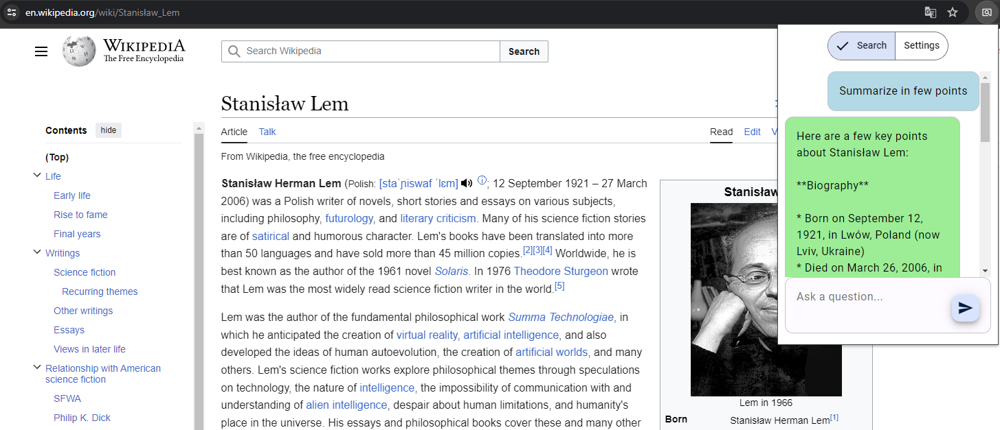
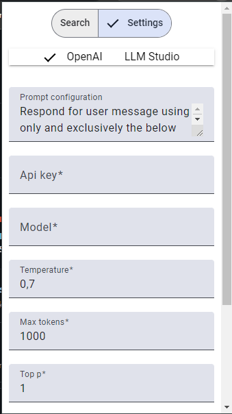

# AiFinderExt

Angular chrome extension to search AI related content on a webpage.

### To build the extension, run `npm run build:extension`.

# How to use

1. Go to `chrome://extensions/` and enable `Developer mode`.
2. Click on `Load unpacked` and select the `chrome-extension` folder.
3. Open a webpage and press `Ctrl+Shift+F` to open the extension popup.
4. Enter the prompt and press `Enter` to search for the content.

# Configuration

1. Go to settings tab.
2. Set all data.
3. `Prompt configuration` is the prompt that will be used to search for the content. It's in SYSTEM MESSAGE send. `${page_content}` is the content of the webpage (document.body.innerText).
4. Click on `Save` to save the configuration.

# Screenshots

